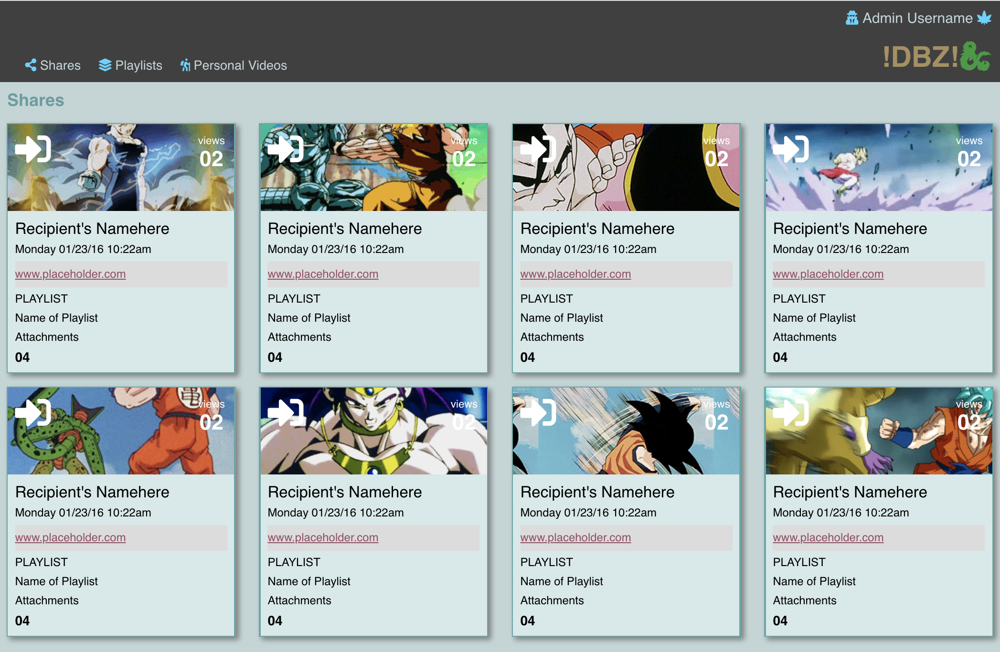
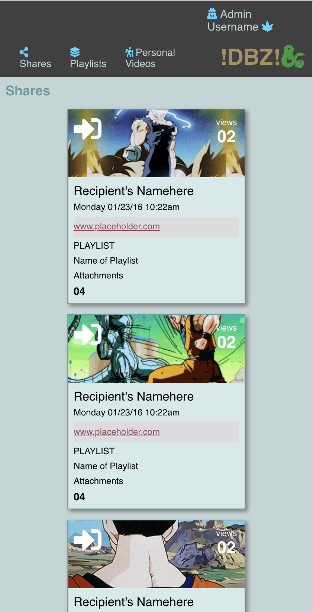

# Static-Comp-1-Redo

Duy Vu

## Overview
- Used CSS to create the static comp
- Some elements on page are responsive at 530px
- Clean HTML
- Semantic HTML tags used
- Used flex to rearrange elements
- JavaScript used to change name of dog

## My-Project

## Responsiveness

